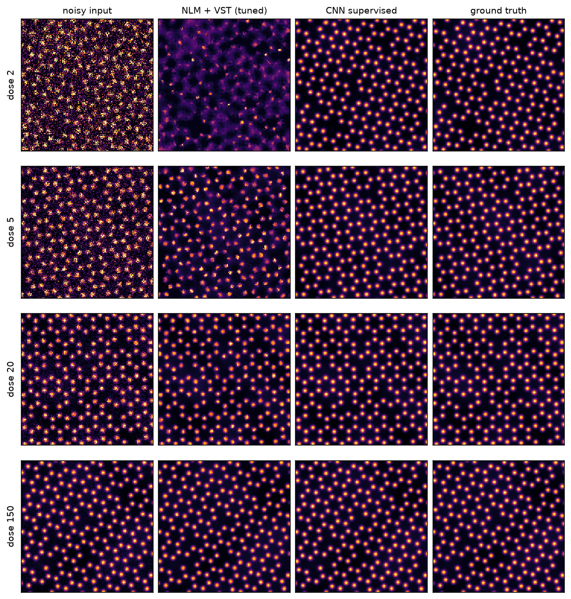
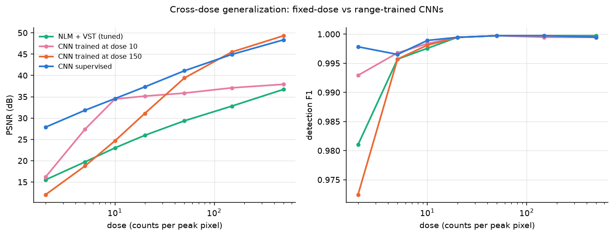

# stem-denoising-restoration

Restoration of low-dose HAADF-STEM images, scored the way a
microscopist would: not just by how clean the image looks (PSNR, SSIM)
but by whether the atoms can still be found in it afterwards (detection
F1 and localization RMSE against exact ground truth). A physics-motivated
simulator provides paired clean and Poisson-noisy atomic-resolution
images across a 250x dose range; three variance-stabilized classical
denoisers compete against a small residual U-Net trained supervised and
as self-supervised Noise2Noise. Everything runs on CPU and every number
regenerates from a fixed-seed YAML config.



## Headline results

Full tables and readings in [RESULTS.md](RESULTS.md); raw values in
`results/*.json`. Doses are expected counts in the brightest pixel of a
column peak; every value below was measured in this repository.

**1. On fidelity, the learned prior is worth 7 to 12 dB.** PSNR on the
hexagonal lattice, classical methods tuned per dose on held-out fields,
one fixed CNN checkpoint across all doses:

| Dose | raw | best classical (tuned) | CNN supervised | CNN Noise2Noise |
|---|---|---|---|---|
| 2 | 8.5 | 20.2 (Gaussian) | **27.9** | 27.6 |
| 10 | 17.2 | 25.3 (Gaussian) | **34.6** | 34.4 |
| 50 | 24.5 | 30.2 (Gaussian) | **41.1** | 40.8 |
| 500 | 34.6 | 36.7 (NLM) | **48.4** | 47.3 |

**2. Noise2Noise needs zero clean images and ties the supervised
model.** Trained purely on pairs of independently noisy views, it
tracks supervised within 0.3 to 1.1 dB PSNR and 0.003 detection F1
everywhere. For real microscopy, where paired clean acquisitions barely
exist, this is the practically relevant result.

**3. PSNR and usefulness are different axes.** On a lattice with a
faint sublattice (0.3 relative weight, a light element beside a heavy
one), every classical denoiser detects worse than no denoising at all,
at every dose, while gaining 6 to 12 dB PSNR; the smoothing that wins
fidelity flattens faint columns into their bright neighbours'
shoulders. PSNR-tuned NLM is simultaneously the best classical method
by PSNR and the worst detector in the benchmark. Retuning the classical
methods directly for detection F1 (`configs/detection_tuned.yaml`) does
not rescue them: they converge to minimal smoothing and match raw. The
CNN sits above raw at every dose (F1 0.990 vs 0.860 at dose 2, with
0.99 precision, so it is finding real faint columns, not inventing
lattice sites).

**4. The CNN advantage is conditional on training coverage.** A model
trained only at dose 150 collapses to 12.0 dB at dose 2, worse than
tuned NLM (15.5 dB). Dose-matched specialists beat the range-trained
model at their own dose by 0.6 to 1.0 dB; range training buys the rest
of the dose axis for that price (`configs/cross_dose.yaml`).

**5. The advantage is also conditional on geometry.** On a lattice
denser than anything in training (spacing 9 px vs 12), the CNN falls
below the tuned Gaussian by 2.8 dB at dose 5 and is the only method
that loses detections (F1 0.958 vs 0.998); a wider probe costs it
4.5 dB at dose 50. Sparser lattices, quadrupled vacancies, and a
fainter second species stay clearly in its favour
(`configs/off_geometry.yaml`). The learned prior has a measurable
range of validity, and the benchmark maps its edges.



## Install and reproduce

```
git clone https://github.com/aamirmalik-dr/stem-denoising-restoration
cd stem-denoising-restoration
python -m venv .venv && .venv/Scripts/activate   # or source .venv/bin/activate
pip install -e ".[dev]"                           # [dev] brings pytest, ruff, black
pytest                                            # 45 tests
```

Quick start on the committed sample data (no downloads, no training):

```
stemdenoise denoise data/sample/hexagonal_d5.npz --method cnn --checkpoint models/unet_supervised.pt
stemdenoise denoise data/sample/hexagonal_d5.npz --method nlm
stemdenoise simulate --preset binary_square --dose 10 --out field.npz
```

Reproduce everything (about 90 minutes of CPU training, then a few
minutes of benchmarks):

```
python scripts/train_all.py
stemdenoise benchmark configs/dose_sweep.yaml
stemdenoise benchmark configs/detection_tuned.yaml
stemdenoise benchmark configs/cross_dose.yaml
stemdenoise benchmark configs/off_geometry.yaml
python scripts/check_scale_robustness.py
python scripts/make_figures.py
```

The executed walkthrough from simulation to final metric is
[notebooks/tutorial.ipynb](notebooks/tutorial.ipynb); the Python API is
documented with examples in [docs/api.md](docs/api.md); the trained
checkpoints are described in [models/MODEL_CARD.md](models/MODEL_CARD.md).

## What is in the box

- `stemdenoise.sim`: HAADF image formation with exact ground truth.
  Two lattice presets (hexagonal single-species, binary with a faint
  sublattice), random rotation and offset, jitter, vacancies, smooth
  contamination background, Poisson shot noise plus Gaussian readout.
- `stemdenoise.classical`: Gaussian, non-local means and BayesShrink
  wavelet denoisers run inside a generalized Anscombe transform with a
  bias-corrected closed-form inverse, so the classical baselines handle
  Poisson statistics properly instead of being strawmen.
- `stemdenoise.net` / `train`: a 263k-parameter residual U-Net
  (identity at initialization) trained on-the-fly-simulated patches,
  supervised or Noise2Noise, on CPU in about 30 minutes.
- `stemdenoise.detect` / `metrics`: a fixed peak finder (parameters
  derived from lattice geometry, identical for every method) and
  Hungarian-matched detection scoring with border exclusion.
- `stemdenoise.benchmark`: the config-driven harness; per-condition
  tuning of classical methods (for PSNR or for F1) on separate tuning
  fields, with chosen parameters written into the results JSON, and
  inline lattice variants in configs for off-distribution checks.
- A CLI (`stemdenoise simulate | denoise | train | benchmark`) and a
  bring-your-own-data path (`stemdenoise.io`) for `.npy`, `.npz`,
  `.png`, `.tif` images of unknown scale.

## Scope, honestly

A note on units: microscopists quote dose as electrons per square
angstrom; this benchmark sweeps expected counts in the brightest pixel
of a column peak instead. The two are related through pixel size, probe
current, dwell time, and detector collection efficiency, none of which
this simulator fixes, so no conversion is quoted. Peak-pixel counts is
the quantity that directly sets the shot-noise statistics the denoisers
fight, which makes it the right independent variable for this
comparison; mapping a real acquisition onto the sweep means estimating
the counts at a bright column in your own frame
(`stemdenoise.io.estimate_dose` does this).

All data is synthetic. The simulator captures the parts of the problem
that make low-dose restoration hard (shot noise at single-digit counts,
Z-contrast spanning a 3x weight ratio, aperiodicity from jitter and
vacancies) and omits parts that matter on real instruments: scan
distortion, drift, amorphous contamination layers, detector
afterglow, and realistic probe tails. The value of the synthetic setup
is exact ground truth, which is what makes detection-based evaluation
and the fair-tuning checks possible at all. The trained models carry
the simulator's structural prior and should be treated as qualitative
on real data (see the model card). No real micrograph is committed; the
bring-your-own-data path and its caveats are documented in
[data/README.md](data/README.md).

## Author

Aamir Malik
GitHub: https://github.com/aamirmalik-dr
LinkedIn: https://linkedin.com/in/dr-aamirmalik

MIT License.
